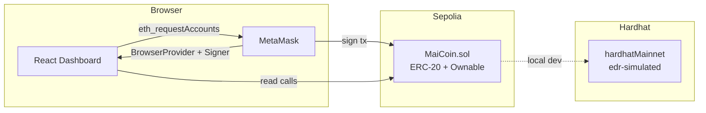
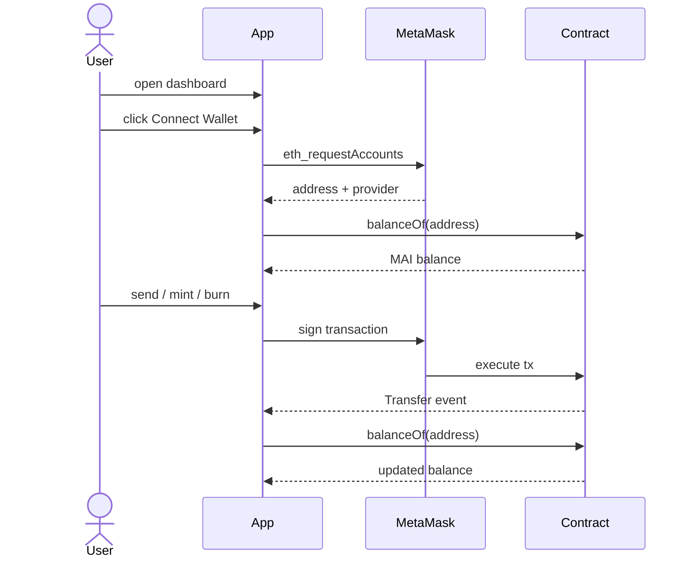

# MaiCoin

A full-stack ERC-20 learning project — Solidity smart contract, Hardhat 3 testing, Sepolia testnet deployment, and a React dashboard for wallet interaction.


---

## What it does

Deploy the `MaiCoin` (MAI) token to Sepolia, send it to friends, let them burn some. Total cost: $0 — Sepolia ETH is free from a faucet.

---

## System architecture



---

## User flow



---

## Local setup

**Prerequisites:** Node.js 22, pnpm, MetaMask browser extension.

```bash
# 1. Clone
git clone git@github.com:LuigiEspinosa/MaiCoin.git
cd MaiCoin

# 2. Install contract dependencies
npm install

# 3. Compile the contract
npx hardhat compile

# 4. Deploy locally
npx hardhat run scripts/deploy.ts --network hardhatMainnet
# Copy the printed address into frontend/src/lib/contract.ts → CONTRACT_ADDRESS

# 5. Install and start the frontend
cd frontend
pnpm install
pnpm dev
# Open http://localhost:5173
```

---

## Sepolia deployment

```bash
# 1. Copy and fill in .env
cp .env.example .env
# SEPOLIA_RPC_URL  — get a free key at alchemy.com
# SEPOLIA_PRIVATE_KEY — your MetaMask private key (never commit this)
# ETHERSCAN_API_KEY — free at etherscan.io

# 2. Get free testnet ETH
# https://sepoliafaucet.com

# 3. Deploy
npx hardhat run scripts/deploy.ts --build-profile production --network sepolia

# 4. Set the frontend env
echo "VITE_CONTRACT_ADDRESS=0x..." > frontend/.env
```

---

## License

MIT
